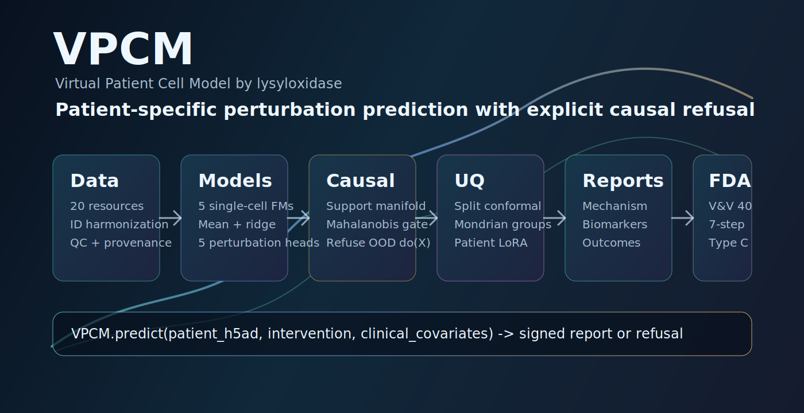

# VPCM



First open AI/ML system with a do-calculus refusal gate and FDA-grade
credibility controls for patient-specific perturbation prediction.

VPCM is a patient-specific, cell-type-specific causal perturbation prediction
system. Version 1.0.0 includes the full Phase 1-7 stack: harmonized data,
foundation-model ensemble, mandatory beat-the-mean baselines, perturbation
predictors, causal refusal, conformal uncertainty, patient LoRA, mechanism and
biomarker projection, outcome heads, signed prediction reports, and regulatory
dossier generation.

Author and maintainer: `lysyloxidase`

## Why It Exists

Single-cell foundation models are powerful representation learners, but
observational pretraining is not enough to claim interventional causality.
VPCM makes that limitation explicit. Every prediction is checked against an
interventional support manifold, benchmarked against train-mean and ridge
baselines, wrapped in conformal uncertainty intervals, signed for auditability,
and restricted to a clinical-trial enrichment Context of Use.

The system is intentionally usable before large data pulls are available:
loaders expose deterministic fixture mode by default, while package metadata
declares the live dependencies for CELLxGENE Census, AnnData, DVC, LaminDB,
RDKit, PyTorch, FastAPI, and downstream model work.

## Core Capabilities

- Patient-specific perturbation prediction over single-cell profiles.
- Five-model single-cell foundation-model ensemble registry.
- Mandatory train-mean and ridge baselines on every prediction.
- Five-predictor perturbation ensemble with MC-dropout uncertainty.
- Do-calculus refusal gate for out-of-support interventions.
- Split, Mondrian, and CQR-style conformal uncertainty quantification.
- Patient-specific rank-8 LoRA adapter metadata and atlas retrieval.
- Mechanism-of-action projection through pathways, GRNs, and communication.
- Biomarker projection to pseudo-bulk tissue and organ lab readouts.
- Survival, competing-risk, and immunotherapy response outcome heads.
- Signed JSON/PDF-like report bundles with Ed25519 provenance.
- ASME V&V 40 dossier, FDA 7-step map, model card, and Type C package tooling.

## Context Of Use

VPCM is intended only for:

- Clinical-trial enrichment and patient-stratification hypothesis generation.
- Drug-repurposing hypothesis generation.
- Biomarker-strategy planning for clinical-trial design.

VPCM must not be used for:

- First-in-human dosing decisions.
- Primary endpoint determination.
- Diagnosis.
- Replacing standard-of-care clinical decision-making.
- Patient-level treatment decisions without clinician override.

## Repository Layout

| Path | Purpose |
|---|---|
| `packages/vpcm_core` | COU config, deterministic execution, audit logging, provenance, typed records. |
| `packages/vpcm_data` | 20-resource data inventory, loaders, harmonization, QC, batch detection. |
| `packages/vpcm_models` | Five-model foundation-model registry and frozen fixture adapters. |
| `packages/vpcm_baselines` | Train-mean/ridge baselines and Csendes/Ahlmann-Eltze reproduction fixtures. |
| `packages/vpcm_perturbation` | CPA, ChemCPA, GEARS, CellOT, scGen ensemble with MC-dropout. |
| `packages/vpcm_causal` | Interventional support manifold and do-calculus refusal reports. |
| `packages/vpcm_conformal` | Split conformal, Mondrian conformal, CQR, coverage audit. |
| `packages/vpcm_lora` | Patient LoRA adapters, atlas retrieval, covariate encoding. |
| `packages/vpcm_mechanism` | Pathway projection, GRN simulation, communication inference, attention caveats. |
| `packages/vpcm_biomarker` | Pseudo-bulk, organ ridge labs, Bagaev TME, TCR, spatial context. |
| `packages/vpcm_outcome` | DeepSurv, DeepHit, response classifier, multi-omic fusion. |
| `packages/vpcm_pipeline` | End-to-end `VPCM.predict()` API and signed report bundle. |
| `packages/vpcm_regulatory` | V&V 40 dossier, FDA 7-step map, model card, benchmark, Type C package. |
| `apps/api` | FastAPI inference service. |
| `docs` | COU, architecture, research report, V&V dossier, regulatory crosswalks. |

## Quick Start

```bash
git clone https://github.com/lysyloxidase/vpcm.git
cd vpcm
python3 -m venv .venv
. .venv/bin/activate
python -m pip install --upgrade pip
python -m pip install -e "packages/vpcm_core[dev]"
python -m pip install -e "packages/vpcm_data[dev]"
python -m pip install -e "packages/vpcm_models[dev]"
python -m pip install -e "packages/vpcm_baselines[dev]"
python -m pip install -e "packages/vpcm_perturbation[dev]"
python -m pip install -e "packages/vpcm_causal[dev]"
python -m pip install -e "packages/vpcm_conformal[dev]"
python -m pip install -e "packages/vpcm_lora[dev]"
python -m pip install -e "packages/vpcm_mechanism[dev]"
python -m pip install -e "packages/vpcm_biomarker[dev]"
python -m pip install -e "packages/vpcm_outcome[dev]"
python -m pip install -e "packages/vpcm_pipeline[dev,api]"
python -m pip install -e "packages/vpcm_regulatory[dev]"
```

Run the API:

```bash
PYTHONPATH=.:packages/vpcm_core/src:packages/vpcm_data/src:packages/vpcm_models/src:packages/vpcm_baselines/src:packages/vpcm_perturbation/src:packages/vpcm_causal/src:packages/vpcm_conformal/src:packages/vpcm_lora/src:packages/vpcm_mechanism/src:packages/vpcm_biomarker/src:packages/vpcm_outcome/src:packages/vpcm_pipeline/src:packages/vpcm_regulatory/src \
  .venv/bin/uvicorn apps.api.main:app --host 127.0.0.1 --port 8010
```

Open:

- Swagger UI: `http://127.0.0.1:8010/docs`
- OpenAPI: `http://127.0.0.1:8010/openapi.json`
- Prediction endpoint: `POST /predict`

## Example API Call

```bash
curl -X POST \
  "http://127.0.0.1:8010/predict?patient_h5ad_path=fixture.h5ad&patient_id=patient-demo&alpha=0.1" \
  -H "Content-Type: application/json" \
  -d '{
    "intervention": {
      "intervention_id": "drug-demo",
      "intervention_type": "drug",
      "target": "CHEMBL25",
      "dose": "1uM"
    },
    "clinical_covariates": {
      "age": 61,
      "sex": "F",
      "stage": "II"
    }
  }'
```

The fixture API returns a signed JSON payload containing:

- `payload`
- `payload_hash`
- `signature.algorithm = Ed25519`

## Quality Gates

```bash
make smoke-test
make ruff
make pyright
make coverage
make doi-check
```

Current v1.0.0 local validation:

- 65 tests passing.
- Total coverage above 85%.
- Ruff clean.
- Pyright strict clean.
- DOI verification over docs references.
- FastAPI `/docs`, `/openapi.json`, and fixture `/predict` working.

## Regulatory Posture

VPCM is organized around a Significant-tier credibility plan:

- ASME V&V 40-2018 dossier generation.
- FDA Jan 2025 seven-step credibility mapping.
- FDA-EMA Good AI Practice cross-reference.
- EMA, MHRA, Health Canada, and NMPA regulatory crosswalks.
- Prospective blinded benchmark fixture with 13 pre-registered thresholds.
- Signed model card and Type C pre-submission package assembly.

## Release

- Current release tag: `v1.0.0`
- License: Apache-2.0
- Maintainer: `lysyloxidase`
